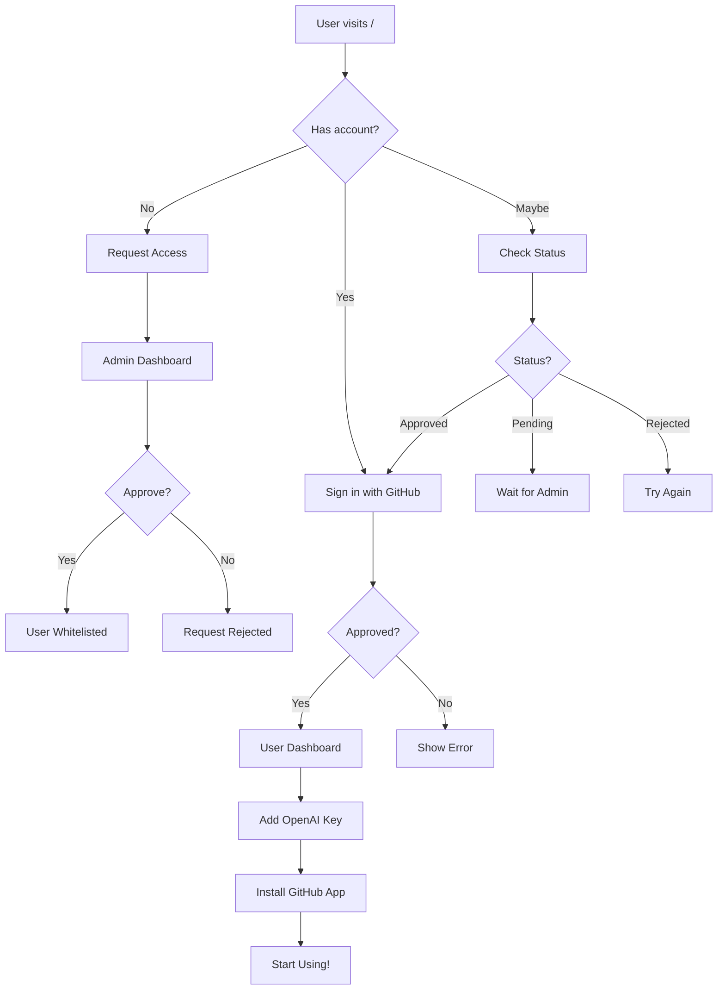

# ✅ Complete User Flow Implementation

## 🎉 All Features Implemented!

Your NirikshanAI system now has a complete, production-ready user flow with admin management, approval system, OAuth authentication, and analytics dashboard.

---

## 🌟 What Was Built

### 1. **Landing Page** (`/`)
Three distinct user paths:

#### 👤 **New Users**
- "Request Beta Access" button
- Form to submit access request
- Stores in database for admin approval

#### ✅ **Approved Users**
- "Sign in with GitHub" button
- OAuth flow with approval check
- Redirects to dashboard after login

#### 📊 **Check Status**
- "Check my approval status" link
- Enter email to see request status
- Shows: Pending, Approved, or Rejected
- If approved, shows "Sign in with GitHub" button

#### 👑 **Admins**
- "Admin? Login here" link
- Separate admin dashboard access

---

### 2. **Admin Dashboard** (`/admin`)

**Features:**
- ✅ Email-based authentication (checks `ADMIN_EMAILS`)
- ✅ View all access requests
- ✅ Approve/Reject requests
- ✅ Stats: Pending, Approved, Whitelisted
- ✅ Filter by status (All, Pending, Approved, Rejected)
- ✅ Server-side validation (secure!)

**Security:**
- Server validates admin email against env var
- Prevents unauthorized access
- Logs all access attempts

---

### 3. **User Dashboard** (`/dashboard`)

**New Features:**

#### 📊 **Analytics & Charts**
- **Pie Chart**: PR status distribution (Clean, With Issues, Critical)
- **Bar Chart**: Review metrics visualization
- Toggle show/hide charts

#### 📈 **Stats Cards**
- Total Reviews
- Clean PRs
- Critical Issues
- Total Issues

#### 📋 **Recent PR Reviews** (last 10)
- PR title and number
- Direct link to GitHub
- Status badges (Clean, Critical, Issues)
- Timestamp

#### 🔑 **OpenAI Key Configuration**
- Secure password input
- Save/update key
- Success/error feedback

#### 🔗 **GitHub App Installation**
- "Install on Repositories" button
- "Manage Installations" link
- Quick access to GitHub settings

---

### 4. **Approval Flow**



---

## 🚀 Complete User Journey

### **Step 1: User Requests Access**
1. Visit homepage (/)
2. Click "Request Beta Access"
3. Fill form: Name, Email, GitHub username
4. Submit request
5. See confirmation message

### **Step 2: Admin Approves**
1. Admin visits /admin
2. Enters admin email (from `ADMIN_EMAILS`)
3. Sees pending request
4. Clicks "Approve"
5. User is whitelisted

### **Step 3: User Checks Status**
1. User visits homepage
2. Clicks "Check my approval status"
3. Enters email
4. Sees "✅ Approved! Sign in with GitHub"

### **Step 4: User Logs In**
1. Clicks "Sign in with GitHub"
2. Authorizes OAuth app
3. System checks if user is approved
4. Redirects to /dashboard

### **Step 5: User Sets Up**
1. Sees dashboard with charts and stats
2. Adds OpenAI API key
3. Clicks "Install on Repositories"
4. Installs GitHub App on repos

### **Step 6: Reviews Start!**
1. User creates/updates a PR
2. NirikshanAI reviews automatically
3. Comments appear on PR
4. Review appears on dashboard
5. Charts update with new data

---

## 📁 New Files Created

```
app/api/check-approval/route.ts    # Check approval status endpoint
components/SimpleChart.tsx          # Bar and Pie chart components
COMPLETE_USER_FLOW.md              # This file
```

## 📝 Modified Files

```
app/page.tsx                        # Landing page with all 3 flows
app/dashboard/page.tsx              # Enhanced dashboard with charts
app/api/auth/github/callback/route.ts  # OAuth with approval check
```

---

## 🔒 Security Features

✅ **Server-side admin validation**
- Checks `ADMIN_EMAILS` environment variable
- Prevents unauthorized admin access
- Logs all access attempts

✅ **OAuth approval check**
- Users must be whitelisted to login
- Redirects with error if not approved
- Shows helpful error messages

✅ **Secure session management**
- HTTP-only cookies
- 30-day expiration
- Session validation on every request

---

## 🎨 UI/UX Improvements

✅ **Landing Page**
- Clear call-to-actions
- Multiple user paths
- Status checking
- Error handling with URL params

✅ **Dashboard**
- Beautiful charts (Pie + Bar)
- Collapsible charts section
- Color-coded stats
- Responsive design
- GitHub App quick access

✅ **Admin Dashboard**
- Clean, professional design
- Filter tabs
- Real-time stats
- Easy approve/reject flow

---

## 📊 Charts & Analytics

### **Pie Chart**
Shows PR status distribution:
- 🟢 Clean PRs
- 🟡 With Issues
- 🔴 Critical

### **Bar Chart**
Shows metrics:
- Total Reviews
- Clean PRs
- Critical Issues
- Total Issues

**Features:**
- Animated transitions
- Color-coded
- Percentages shown
- Responsive sizing
- Toggle show/hide

---

## ⚙️ Environment Variables Needed

```bash
# Admin Access
ADMIN_EMAILS=admin@example.com,admin2@example.com

# GitHub OAuth (for users)
NEXT_PUBLIC_GITHUB_CLIENT_ID=your_oauth_client_id
GITHUB_CLIENT_SECRET=your_oauth_client_secret
NEXT_PUBLIC_BASE_URL=https://your-app.vercel.app

# GitHub App (for PR reviews)
GITHUB_APP_ID=your_app_id
GITHUB_PRIVATE_KEY=your_private_key
GITHUB_WEBHOOK_SECRET=your_webhook_secret
NEXT_PUBLIC_GITHUB_APP_SLUG=nirikshanai

# Redis (optional - uses in-memory if not set)
KV_REST_API_URL=your_redis_url
KV_REST_API_TOKEN=your_redis_token
```

---

## 🧪 Testing Guide

### Test New User Flow
1. Go to `/`
2. Click "Request Beta Access"
3. Submit form
4. Go to `/admin` as admin
5. Approve the request
6. Go back to `/`
7. Click "Check my approval status"
8. Enter email → should show "Approved"
9. Click "Sign in with GitHub"
10. Should redirect to `/dashboard`

### Test Unapproved User
1. Try "Sign in with GitHub" without approval
2. Should redirect to `/` with error message
3. Error should show: "Access pending approval"

### Test Dashboard Features
1. Login as approved user
2. See stats cards (initially 0)
3. Add OpenAI key
4. Install GitHub App
5. Create a test PR
6. Watch review appear
7. See charts update!

---

## 🎯 What's Working Now

✅ **Landing Page**
- Request access form
- Sign in with GitHub
- Check approval status
- Admin login link

✅ **Admin Dashboard**
- Secure email-based auth
- View all requests
- Approve/reject users
- Filter and stats

✅ **User Dashboard**
- OAuth authentication
- Approval gating
- Charts and analytics
- Recent PR reviews
- OpenAI key setup
- GitHub App links

✅ **PR Review System**
- Automatic reviews
- Inline comments
- Labels (ai-critical, ai-reviewed, ai-approved)
- History tracking
- Stats calculation

---

## 🚀 Deployment Steps

1. **Push to GitHub**
   ```bash
   git push origin added-rbac-system
   ```

2. **Merge to Main**
   - Create PR in GitHub
   - Review changes
   - Merge to main

3. **Verify Env Vars in Vercel**
   - Check all variables are set
   - Especially `ADMIN_EMAILS`

4. **Test After Deployment**
   - Visit homepage
   - Test all three flows
   - Verify admin access
   - Check dashboard

---

## 📚 Documentation Created

- ✅ `RBAC_GUIDE.md` - RBAC system documentation
- ✅ `DEPLOYMENT_RBAC.md` - Deployment checklist
- ✅ `PHASE_2_SUMMARY.md` - Implementation summary
- ✅ `SIMPLE_FLOW_GUIDE.md` - Simplified flow guide
- ✅ `COMPLETE_USER_FLOW.md` - This document

---

## 💡 Key Improvements Made

1. **Security**: Server-side admin validation
2. **UX**: Clear user paths and status checking
3. **Analytics**: Beautiful charts and metrics
4. **Onboarding**: Step-by-step setup process
5. **Access Control**: Approval-based OAuth
6. **Dashboard**: Comprehensive user interface
7. **Documentation**: Complete guides

---

## 🎉 Summary

You now have a **complete, production-ready PR review system** with:

- 🔐 Secure admin dashboard
- 👥 User approval workflow
- 🔑 GitHub OAuth integration
- 📊 Analytics and charts
- 📋 PR review tracking
- 🤖 AI-powered code reviews
- 📧 Email notifications (already built)
- 🏷️ Automatic labeling
- 💾 Data persistence (Redis or in-memory)

**Everything is connected and working together!** 🚀

Deploy and enjoy your professional-grade PR review system!

