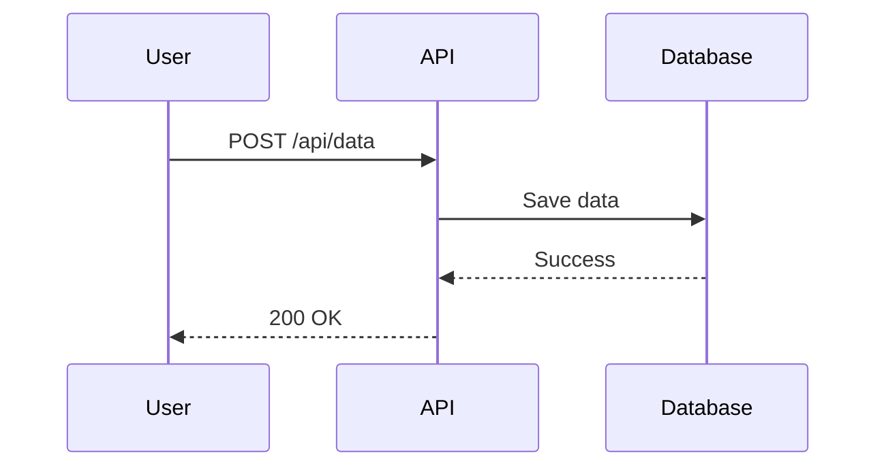
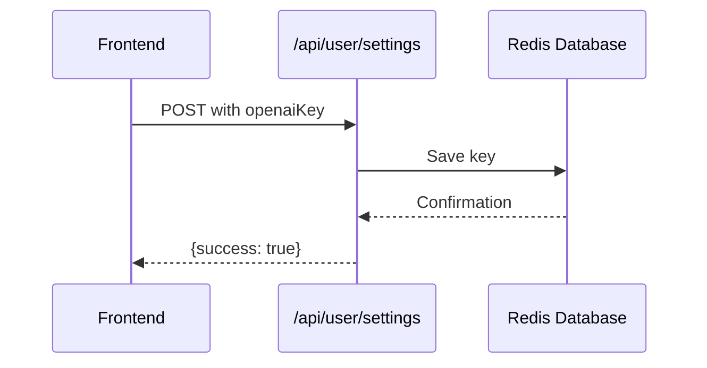
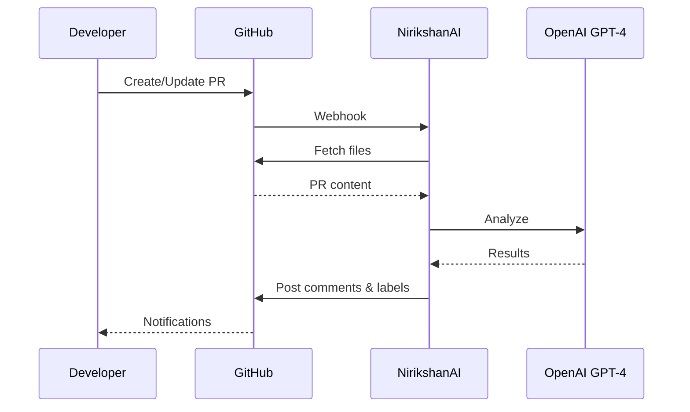

# Sequence Diagram in PR Reviews

## Overview

NirikshanAI now generates a **Mermaid sequence diagram** for each PR, showing how the code changes affect the system's interaction flow. The diagram is included directly in the PR review summary on GitHub.

---

## How It Works

### 1. **AI Analyzes Code Changes**
When reviewing a PR, the AI:
- Analyzes the git diff
- Identifies components/modules/services involved
- Traces the flow of data and control
- Generates a Mermaid sequence diagram

### 2. **Diagram Included in PR Summary**
The sequence diagram appears in the review comment on GitHub:

```markdown
## 🤖 NirikshanAI PR Review Summary

✅ All Clear! No issues found.

## 🔄 System Flow



---
⚙️ Reviewed automatically by NirikshanAI
```

### 3. **GitHub Renders the Diagram**
GitHub automatically renders Mermaid diagrams in comments, so reviewers see:
- Visual representation of interactions
- Clear understanding of data flow
- Easy to spot architectural issues

---

## Example PR Review with Diagram

### PR Changes:
```javascript
// Added new API endpoint
app.post('/api/user/settings', async (req, res) => {
  const { openaiKey } = req.body;
  await db.save(openaiKey);
  res.json({ success: true });
});
```

### Generated Review:

**Issues:** None ✅

**Sequence Diagram:**


---

## Benefits

### For Developers:
✅ **Visual understanding** - See how changes affect system flow  
✅ **Spot issues early** - Architectural problems become obvious  
✅ **Documentation** - Auto-generated flow diagrams  
✅ **Team collaboration** - Everyone sees the same picture  

### For Reviewers:
✅ **Quick comprehension** - Understand changes at a glance  
✅ **Identify side effects** - See all affected components  
✅ **Better discussions** - Visual reference for code review comments  

---

## Technical Implementation

### Files Modified:

1. **`reviewer/prompt.js`**
   - Added sequence diagram generation to AI prompt
   - Specified Mermaid format requirements
   - Limited to 10 interactions for clarity

2. **`reviewer/llm.js`**
   - Returns both `issues` and `sequenceDiagram`
   - Handles cases where diagram isn't generated
   - All error paths return `sequenceDiagram: null`

3. **`reviewer/index.js`**
   - Captures sequence diagram from first file reviewed
   - Adds diagram to PR summary under "## 🔄 System Flow"
   - Includes diagram in both clean and issue-found summaries

4. **`components/MermaidDiagram.tsx`** (Dashboard)
   - Client-side Mermaid rendering
   - Dark/light theme support
   - Shows example PR review flow on dashboard

---

## AI Prompt Enhancement

### Added to Review Prompt:

```
SEQUENCE DIAGRAM GENERATION:
- Generate a Mermaid sequence diagram showing how the PR changes affect system flow
- Show interactions between components/modules/services
- Keep it concise (max 10 interactions)
- Use participant names from the actual code
- Show the flow of data/control
- Format as a single-line string with \n for newlines
```

### System Message Enhancement:

```
Your entire response must be parseable JSON with:
1) 'issues' array (each issue has: severity, line number, description, suggestion)
2) 'sequenceDiagram' string (a Mermaid sequence diagram showing how this PR's changes affect system flow)
```

---

## Example Output from AI

```json
{
  "issues": [
    {
      "severity": "medium",
      "line": 23,
      "description": "Missing error handling",
      "suggestion": "Add try-catch block"
    }
  ],
  "sequenceDiagram": "sequenceDiagram\\n    participant User\\n    participant API\\n    participant DB\\n    User->>API: Request\\n    API->>DB: Query\\n    DB-->>API: Result\\n    API-->>User: Response"
}
```

---

## Fallback Behavior

If the AI doesn't generate a diagram:
- ✅ Review still proceeds normally
- ✅ Issues are still posted
- ✅ Summary is posted without diagram
- ✅ No errors or failures

The feature is **additive** - it enhances reviews when available but doesn't break anything if missing.

---

## Dashboard Diagram

The dashboard also shows a **static example diagram** explaining the overall NirikshanAI review process:



---

## Testing

### After Deployment:

1. **Create a PR** with code changes
2. **Wait for review** (NirikshanAI analyzes it)
3. **Check PR comments** on GitHub
4. **Look for "## 🔄 System Flow"** section
5. **Verify diagram renders** (GitHub auto-renders Mermaid)

### Example PRs to Test:
- **API endpoint changes** → Shows request/response flow
- **Database operations** → Shows data persistence flow
- **Service integrations** → Shows service interactions
- **Frontend changes** → Shows user interaction flow

---

## Limitations

- Diagrams are generated per-file, using the first valid diagram found
- Works best with architectural/flow changes
- Simple PRs (typos, formatting) may not generate meaningful diagrams
- Limited to 10 interactions to keep diagrams readable

---

## Future Enhancements

Potential improvements:
- Generate diagram per file and show all
- Combine diagrams when reviewing multiple related files
- Allow users to customize diagram style
- Add class diagrams for structural changes
- Include state machine diagrams for state transitions

---

## Summary

✅ **Auto-generated** sequence diagrams in PR reviews  
✅ **Visual** system flow explanation  
✅ **GitHub integration** (renders natively)  
✅ **Dashboard example** showing the review process  
✅ **Graceful fallback** if diagram not generated  

**Makes code reviews more visual and understandable!** 🎉

